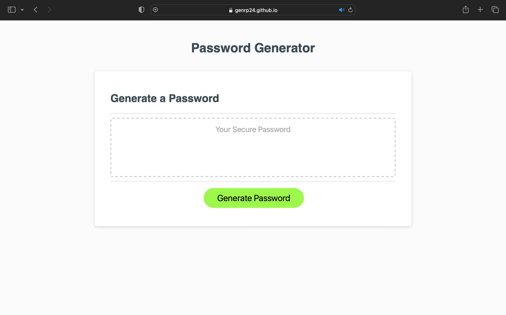
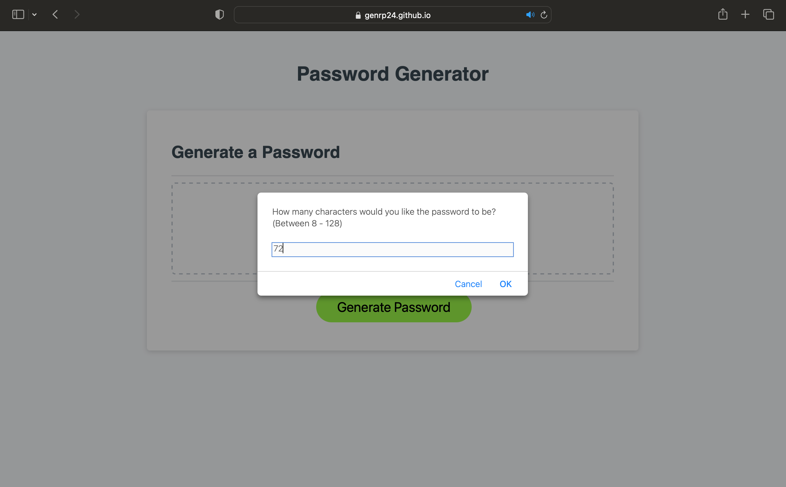
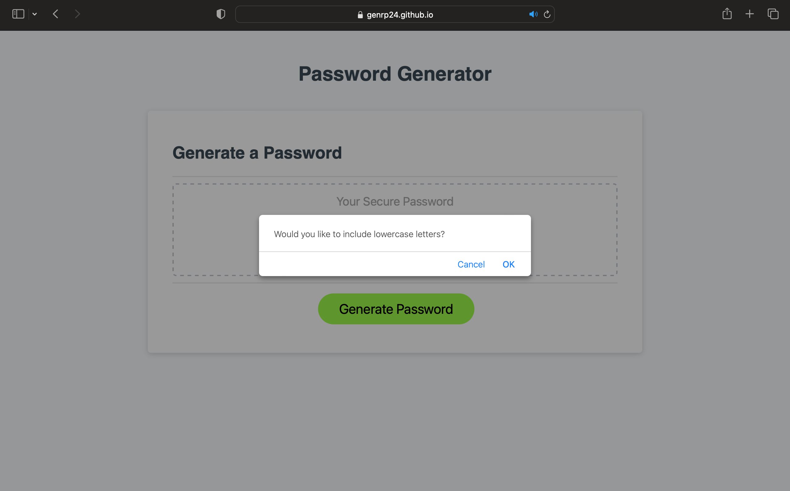
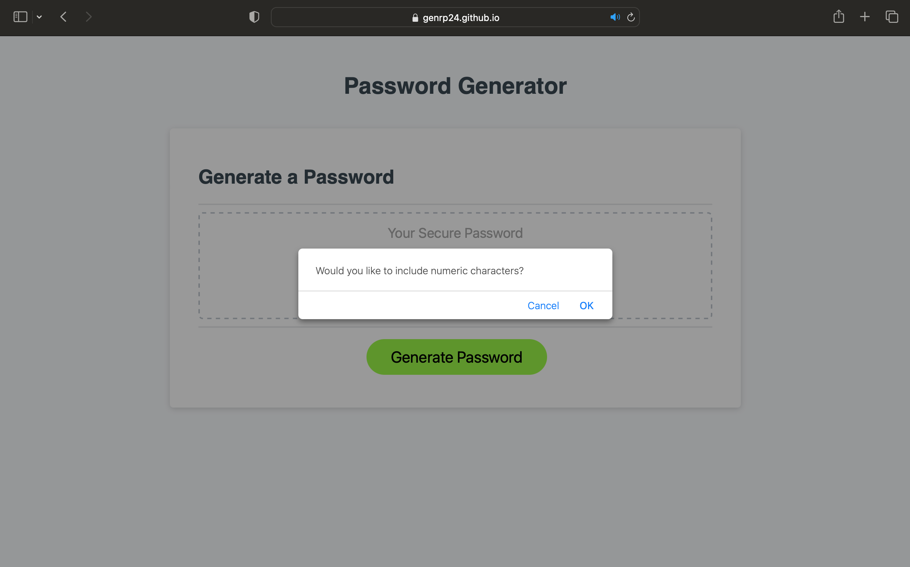
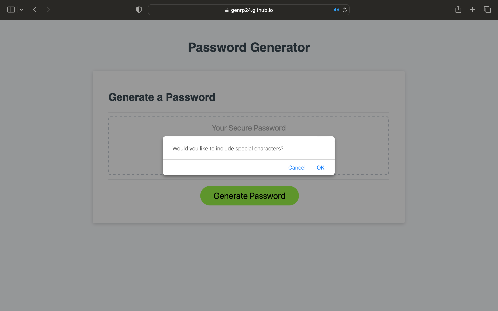
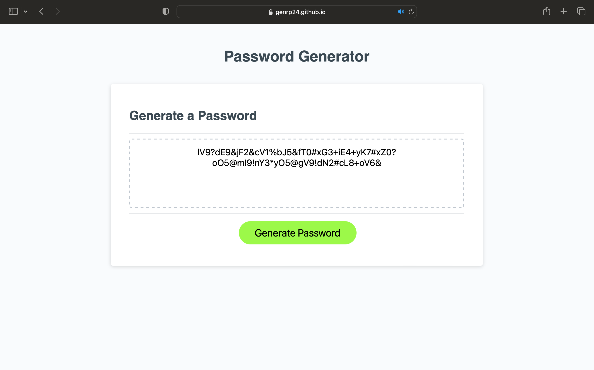

# Password Generator

## Description

This webpage was created to allow a user to generate a random password. A user just has to answer some prompts to confirm what password criteria they would like in their password. The criteria can include lowercase letters, uppercase letters, numbers, and special characters. A user can also tell the generator how long they want the password to be. In writing the JavaScript for this I gained a better understanding of conditional statements, iteration, and methods.

## Table of Contents

- [Installation](#installation)
- [Usage](#usage)
- [Credits](#credits)
- [License](#license)

## Installation

No installation steps are required. This application may be visited at https://genrp24.github.io/password-claw-machine/

## Usage

**How It Works:**
  **Steo 1:** When visiting the site at ***https://genrp24.github.io/password-claw-machine/*** a user will see the page with a generate password button.
 
  **Step 2:** Next a user will be prompted to answer a series of questions that will give the webpage criteria to follow when generating the password. The questions are shown below.
 
 
 
 
 
  **Step 3:** Once all prompts have been answered a random password will be generated and displayed on the screen.
 

## Credits

 **Foolish Developer** ***https://dev.to/code_mystery/random-password-generator-using-javascript-6a*** For technical support and walkthrough of how one can use JavaScript to create a Random Password Generator.

## License

Please refer to the license in the repo.**
 **https://github.com/genrp24/password-claw-machine**